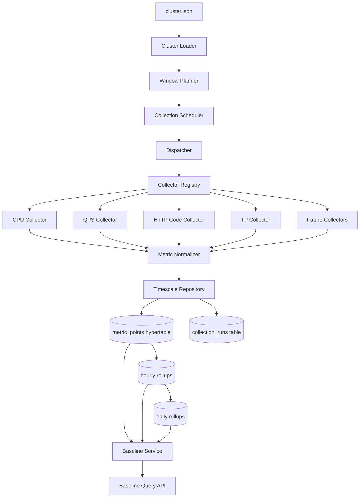

# Design Document

## Overview

本功能用于构建一个面向运维人员的集群指标平台。系统将按 5 分钟粒度采集所有已配置集群的指标，统一写入 TimescaleDB，并提供补数、失败重试和基线查询接口。第一版不包含前端页面和告警能力。

### Goals

- 持续采集所有集群的 5 分钟指标
- 适配现有且持续扩展的 `tools` API
- 使用统一的时间序列模型存储指标
- 支持补数、幂等写入、失败追踪
- 支持基于历史数据的基线查询

### Non-Goals

- 不实现前端页面
- 不实现告警策略和告警投递
- 不定义生产部署拓扑

### Research-Informed Decisions

1. 本地测试环境采用 `macOS + Homebrew + self-hosted TimescaleDB`，不依赖 Docker。
2. 原始指标存储使用 TimescaleDB hypertable，避免把所有时间范围都扫普通表。
3. 基线查询依赖连续聚合，避免在应用内对大量原始数据做全量聚合。
4. 连续聚合和原始表的保留策略分离设计，因为 TimescaleDB 不会自动把 hypertable retention 继承到连续聚合。
5. Collector 采用插件式扩展点，因为 `tools` API 会持续新增。

## Architecture

### High-Level Architecture



### Runtime Modes

系统提供三类运行模式：

1. `scheduled collect`
   - 自动采集刚刚关闭的 5 分钟时间窗
   - 固定使用 canonical closed window，而不是“上次完成时间 + 5 分钟”
2. `manual collect / backfill`
   - 对指定集群、指定时间范围执行补数
   - 以 5 分钟为步长顺序推进时间游标
3. `baseline query`
   - 查询指定集群、指定指标、指定时间范围的基线值

### Key Design Decisions

#### 1. 插件式 Collector，而不是在调度器中写死工具分支

原因：

- `tools` API 会持续扩展
- 每个工具的入参格式和返回格式不同
- 调度器应只负责任务编排，不理解工具细节

结果：

- 每个新工具只需要新增一个 collector 适配器
- 不需要修改 scheduler/dispatcher/repository

#### 2. 原始存储使用窄表，而不是宽表

原因：

- 新增指标不应触发表结构变更
- HTTP 状态码、网卡方向等天然带维度
- 宽表会让演进和补数复杂化

结果：

- 所有指标统一为 `MetricPoint`
- 维度通过 `labels` 表达

#### 3. 调度器使用受控并发，而不是无限并发

原因：

- 当前规模约 70 个集群，但未来工具数会增加
- 上游 API 可能限流或抖动
- 失败场景必须可恢复

结果：

- 使用统一 dispatcher
- 设置全局并发数和单 collector 超时
- 支持 retry 和 partial success

#### 4. 实时采集和历史补采使用不同的窗口推进规则

原因：

- 实时采集的目标是稳定追踪最近闭合桶，不能受任务执行耗时影响
- 历史补采的目标是无遗漏地覆盖完整时间范围，需要显式游标推进
- 如果统一用“采完再 +5 分钟”的逻辑，实时模式会产生时间漂移

结果：

- `scheduled collect` 总是计算“最近闭合的 5 分钟桶”
- `backfill` 总是按 `cursor += 5 minutes` 顺序推进
- 一个 backfill 窗口必须在目标集群采集结束后才进入下一个窗口

#### 5. 基线查询优先走数据库聚合，而不是应用层聚合

原因：

- 用户会频繁查询按时间段计算的基线
- 基线计算天然适合 SQL 聚合
- 连续聚合能显著减少扫描量

结果：

- 原始表存完整事实数据
- 小时/天级聚合由数据库负责
- API 层只编排查询条件和输出格式

#### 6. Hypertable 第一版只按时间分区，不增加集群二级分区

原因：

- 当前规模下主要压力来自时间范围扫描，而不是多磁盘并行扩展
- Timescale 官方对额外维度的建议较保守，空表才能添加维度，后期调整成本高
- 当前查询可以通过 `(cluster_name, bucket_time)` 组合索引满足

结果：

- `metric_points` 只按 `bucket_time` 建 hypertable
- 依赖普通索引支持 cluster 过滤
- 后续只有在写入规模显著增长时才评估二级维度

## Components and Interfaces

### 1. Cluster Loader

职责：

- 读取 `cluster.json`
- 输出扁平集群列表
- 保留分组信息

输入：

- `cluster.json`

输出：

```python
ClusterConfig(
    group_name="lan-ha-jd",
    cluster_name="lf-lan-ha1",
    enabled=True,
)
```

接口：

```python
def load_clusters(path: str) -> list[ClusterConfig]:
    ...
```

### 2. Window Planner

职责：

- 生成标准化的 5 分钟时间窗
- 将任意触发时间归一到“刚刚结束的时间桶”
- 为 backfill 生成连续前进的 5 分钟窗口序列

统一规则：

- 当任务在 `10:00:00` 触发时，采集 `09:55:00 <= t < 10:00:00`
- `bucket_time` 固定为窗口起始时间
- backfill 从给定 `start_time` 对齐到 5 分钟边界后，按 `+5 minutes` 顺序推进到 `end_time`

接口：

```python
def get_closed_window(now: datetime, step_minutes: int = 5) -> TimeWindow:
    ...

def iter_windows(start: datetime, end: datetime, step_minutes: int = 5) -> Iterator[TimeWindow]:
    ...
```

### 3. Collector Interface

职责：

- 适配某一类工具 API
- 将工具原始结果转换为统一的 `MetricPoint`

接口：

```python
class Collector(Protocol):
    name: str

    def collect(self, cluster: str, window: TimeWindow) -> CollectorResult:
        ...
```

`CollectorResult`：

- `status`: `success | partial_success | failed`
- `points`: `list[MetricPoint]`
- `error`: `CollectorError | None`

### 4. Collector Registry

职责：

- 注册启用中的 collector
- 向 dispatcher 提供当前 collector 集合

接口：

```python
class CollectorRegistry:
    def register(self, collector: Collector) -> None: ...
    def enabled_collectors(self) -> list[Collector]: ...
```

### 5. Dispatcher

职责：

- 按“集群 x collector x 时间窗”生成执行单元
- 控制并发
- 捕获错误
- 汇总执行结果

执行策略：

- 一个时间窗内先展开所有集群
- 每个集群执行所有已注册 collector
- 任一 collector 失败不阻塞其他 collector
- 任一集群失败不阻塞其他集群
- backfill 模式下仅在当前时间窗的目标集群处理完成后推进到下一时间窗

接口：

```python
class Dispatcher:
    async def run_window(self, window: TimeWindow, clusters: list[ClusterConfig]) -> DispatchSummary:
        ...
```

### 6. Storage Repository

职责：

- 批量写入指标点
- 幂等 upsert
- 记录 collector 执行状态

接口：

```python
class MetricsRepository:
    def upsert_points(self, points: list[MetricPoint]) -> int:
        ...

    def save_run_records(self, runs: list[CollectionRun]) -> int:
        ...
```

### 7. Baseline Service

职责：

- 根据查询模式生成 SQL
- 读取 raw table 或 rollup
- 输出标准化基线响应

支持的第一版基线模式：

1. `historical_range`
   - 例如：查询 `10:00-13:00` 的 CPU 历史基线
   - 默认统计过去 7 天相同墙钟时间窗口
2. `last_week_same_range`
   - 例如：查询“上周同时间段 CPU 基线”
   - 固定将输入时间范围整体偏移 7 天

接口：

```python
class BaselineService:
    def query_baseline(self, request: BaselineQuery) -> BaselineResponse:
        ...
```

### 8. Operational Interfaces

第一版采用“CLI + HTTP”混合方式：

- CLI 用于采集和补数
- HTTP API 用于基线查询

#### CLI

```bash
python -m src.main collect-window --window-end "2026-03-11 10:00:00"
python -m src.main backfill --start "2026-03-10 00:00:00" --end "2026-03-10 12:00:00"
```

语义说明：

- `collect-window` 用于显式采集某一个已知 5 分钟窗口
- `scheduled collect` 在运行时自动求得“最近闭合的 5 分钟窗口”
- `backfill` 会把 `start-end` 拆成连续 5 分钟窗口，并在每个窗口完成目标集群采集后再推进下一个窗口

#### HTTP API

`POST /api/v1/baselines/query`

请求体：

```json
{
  "cluster_name": "lf-lan-ha1",
  "metric_name": "cpu_avg",
  "start_time": "2026-03-11T10:00:00+08:00",
  "end_time": "2026-03-11T13:00:00+08:00",
  "mode": "historical_range",
  "lookback_days": 7,
  "aggregations": ["avg", "p50", "p95"]
}
```

响应体：

```json
{
  "cluster_name": "lf-lan-ha1",
  "metric_name": "cpu_avg",
  "mode": "historical_range",
  "query_window": {
    "start_time": "2026-03-11T10:00:00+08:00",
    "end_time": "2026-03-11T13:00:00+08:00"
  },
  "baseline_summary": {
    "avg": 41.2,
    "p50": 39.8,
    "p95": 60.5
  },
  "points": [
    {
      "bucket_time": "2026-03-11T10:00:00+08:00",
      "avg": 39.1,
      "p50": 38.7,
      "p95": 45.3
    }
  ]
}
```

## Data Models

### Domain Models

```python
@dataclass
class TimeWindow:
    bucket_time: datetime
    start_time: datetime
    end_time: datetime
    window_seconds: int


@dataclass
class MetricPoint:
    cluster_name: str
    bucket_time: datetime
    window_start: datetime
    window_end: datetime
    metric_name: str
    metric_value: float
    labels: dict[str, str]
    labels_fingerprint: str
    source_tool: str
    collected_at: datetime


@dataclass
class CollectionRun:
    run_id: UUID
    cluster_name: str
    collector_name: str
    bucket_time: datetime
    status: str
    retry_count: int
    started_at: datetime
    finished_at: datetime
    error_code: str | None
    error_message: str | None
```

### Database Schema

#### 1. `metric_points`

用途：

- 存储成功标准化后的事实指标点

建议字段：

```sql
CREATE TABLE metric_points (
    bucket_time         TIMESTAMPTZ NOT NULL,
    window_start        TIMESTAMPTZ NOT NULL,
    window_end          TIMESTAMPTZ NOT NULL,
    cluster_name        TEXT NOT NULL,
    metric_name         TEXT NOT NULL,
    metric_value        DOUBLE PRECISION NOT NULL,
    labels              JSONB NOT NULL DEFAULT '{}'::jsonb,
    labels_fingerprint  TEXT NOT NULL,
    source_tool         TEXT NOT NULL,
    collected_at        TIMESTAMPTZ NOT NULL DEFAULT now(),
    PRIMARY KEY (bucket_time, cluster_name, metric_name, labels_fingerprint)
);
```

Hypertable：

- 时间列：`bucket_time`
- 默认 chunk interval：`1 day`

理由：

- 当前写入规模中等，1 天粒度便于运维和排障
- 后续如果采集粒度显著变细，可调整 chunk interval

#### 2. `collection_runs`

用途：

- 存储每次 collector 执行结果
- 支持重试、补数和失败追踪

建议字段：

```sql
CREATE TABLE collection_runs (
    run_id            UUID PRIMARY KEY,
    bucket_time       TIMESTAMPTZ NOT NULL,
    cluster_name      TEXT NOT NULL,
    collector_name    TEXT NOT NULL,
    status            TEXT NOT NULL,
    retry_count       INTEGER NOT NULL DEFAULT 0,
    started_at        TIMESTAMPTZ NOT NULL,
    finished_at       TIMESTAMPTZ NOT NULL,
    error_code        TEXT NULL,
    error_message     TEXT NULL
);
```

索引：

- `(bucket_time, status)`
- `(cluster_name, bucket_time)`
- `(collector_name, bucket_time)`

### Metric Naming

第一版建议标准 metric 名称：

- `cpu_avg`
- `net_bps` with labels `{"direction":"in"}` / `{"direction":"out"}`
- `qps_avg`
- `http_code_count` with labels `{"class":"2xx"}` / `4xx` / `5xx`
- `tp_avg`

### Continuous Aggregates

第一版设计两个聚合层：

1. `metric_rollup_1h`
2. `metric_rollup_1d`

说明：

- 原始采集已经是 5 分钟粒度，因此不再单独物化 5 分钟聚合
- 如果未来引入更细粒度原始点，可新增 5 分钟连续聚合，而不改应用层接口
- 第一版不依赖 real-time aggregate 默认行为；最近闭合时间窗优先从 raw table 读取，历史窗口优先走 rollup

#### Hourly Rollup

用于：

- 快速查询长时间跨度趋势
- 为日级基线查询减少扫描量

#### Daily Rollup

用于：

- 长期保留
- 按日统计的基线和趋势分析

### Retention Strategy

第一版建议：

- 原始 `metric_points` 保留 180 天
- `metric_rollup_1h` 保留 365 天
- `metric_rollup_1d` 保留 730 天

注意：

- 连续聚合 retention 与原始 hypertable retention 必须分别配置
- 原始表 retention 不能短于连续聚合 refresh 所需回看窗口

### Local Testing Installation Baseline

本地测试环境使用 macOS + Homebrew，最低需要：

1. 安装 PostgreSQL
2. 安装 TimescaleDB
3. 执行 `timescaledb-tune`
4. 在测试库中执行 `CREATE EXTENSION IF NOT EXISTS timescaledb`

这部分只作为本地开发验证基线，不视为生产部署方案。

## Error Handling

### Collector Errors

错误来源：

- 网络超时
- API 认证失败
- API 返回非预期 JSON
- 工具返回无数据
- 解析失败

处理策略：

- 标准化为 `CollectorError`
- 写入 `collection_runs`
- 不让单个 collector 失败中断整个时间窗任务

### Dispatcher Errors

错误来源：

- 任务超时
- 并发执行异常
- collector 抛出未捕获异常

处理策略：

- dispatcher 捕获异常并降级为失败任务
- 保留 cluster、collector、window 上下文
- 失败任务可由 backfill 重新执行

### Database Errors

错误来源：

- 连接失败
- SQL 执行失败
- 事务冲突

处理策略：

- 按批写入，避免整窗超大事务
- 单批失败时记录失败批次和窗口范围
- 对幂等 upsert 冲突按成功处理

### Baseline Query Errors

错误来源：

- 查询参数非法
- 指标不存在
- 无历史数据
- 数据库聚合失败

处理策略：

- 非法参数返回 `400`
- 指标不存在返回 `404` 或业务错误码
- 无历史数据返回明确 `no_data`
- 数据库异常返回 `500`

## Testing Strategy

### Testing Principles

1. 先测试，再进入下一阶段
2. 先 mock，再联调
3. 先单时间窗，再连续运行

### Test Layers

#### 1. Unit Tests

覆盖范围：

- 时间窗归一
- cluster loader
- collector 适配
- metric normalization
- baseline rule building

要求：

- 不依赖真实 API
- 不依赖真实数据库

#### 2. Integration Tests

覆盖范围：

- Timescale schema 初始化
- hypertable 创建
- upsert 行为
- continuous aggregate 查询
- repository 行为

要求：

- 在 macOS 本地 Homebrew 安装的测试库中执行

#### 3. End-to-End Tests

覆盖范围：

- 单时间窗采集链路
- 小规模集群联调
- 补数链路
- 基线查询接口

建议顺序：

1. 1 个集群 + 1 个时间窗
2. 5 个集群 + 1 个时间窗
3. 全量集群 + 单轮调度

### Stage Gates

实现阶段必须按如下门禁推进：

1. 工具契约测试通过后，才能进入 collector 实现
2. collector 单测通过后，才能进入 dispatcher
3. dispatcher 测试通过后，才能进入数据库入库
4. 数据库集成测试通过后，才能进入端到端联调
5. 端到端联调通过后，才能进入定时采集和补数
6. 基线查询 SQL 与手工结果一致后，才能开放 API

## Open Questions

当前仍保留以下实现期决策点：

1. baseline 默认 lookback 是 7 天还是 4 周
2. baseline 返回是否需要同时输出分桶序列和整体摘要
3. 是否需要在第一版加入 collector 级别启停配置

这些问题不阻塞当前设计，可以在任务执行阶段固定为默认值：

- `historical_range` 默认 lookback 7 天
- baseline 同时返回 `summary + points`
- collector 默认全部启用
